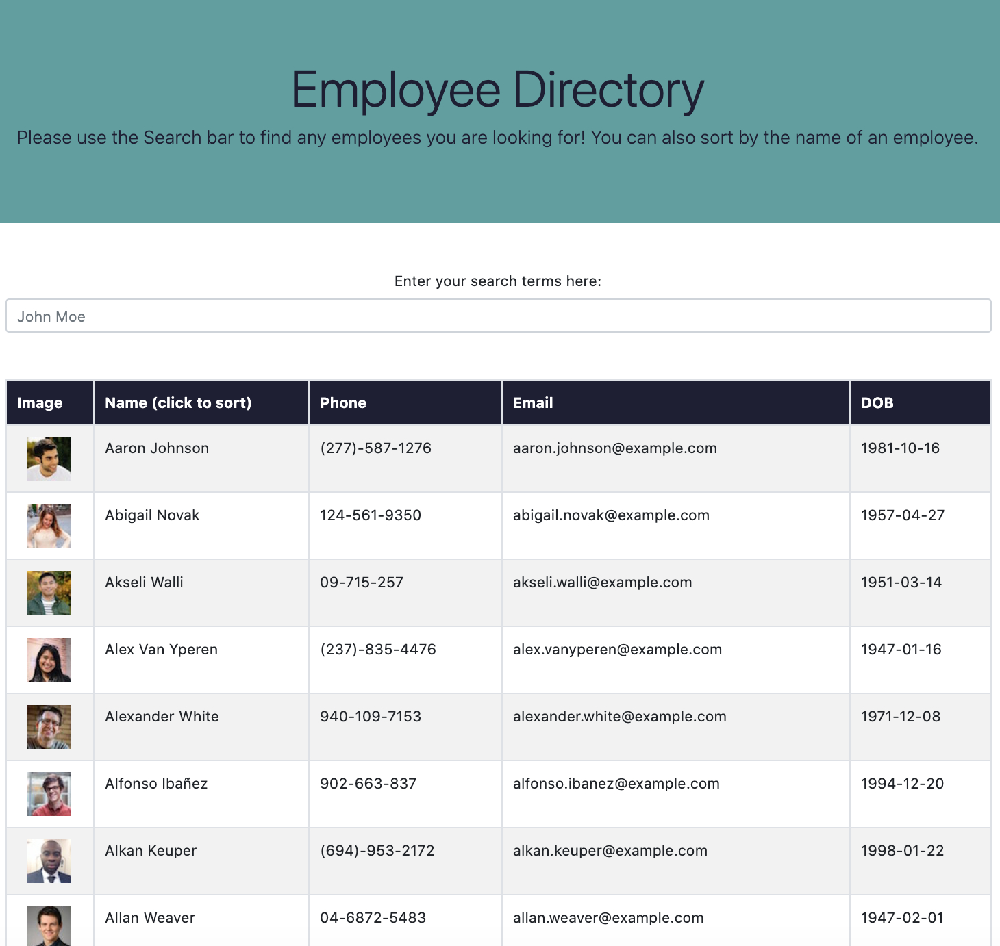

# Employee-Directory

  

## Table of Contents

* [Link](#link)
* [Description](#description)
* [Design](#design)
* [Installation](#installation)
* [Usage](#usage)
* [Future Development](#futuredevelopment)
* [Questions](#questions)

## Link

Access the application [here](https://vxmao87.github.io/Employee-Directory/).

## Description

An employee directory with the option to search for employees by name, and sort by first name.

## Design

The overall design uses the following:

* React for the overall application
* `node` for running application
* HTML, CSS, JavaScript and jQuery for website design

## Installation

To use this app in your environment:

1. Run the command `npm install` to install all the required dependencies.
1. Run the command `npm start` to start the application.

## Usage

Using this app, you can view a directory of up to 200 employees, and view their picture, phone number, email address and date of birth. By clicking the "Name" tab on the table, you can sort the employees by first name. You can also search employees by name if you wish.

## Future Development

* Add sort functionality to DOB, phone number and email

## Questions

For questions or collaborations, please contact me through [GitHub](https://github.com/vxmao87).
